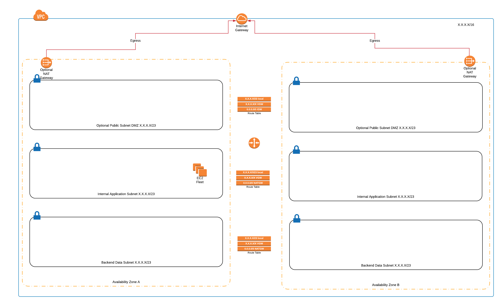

#### 1.0 TEMPLATE NAME 
vpc

#### 2.0 VERSION
terraform v0.14.5 


#### 3.0 DESCRIPTION 

This template deploys a multi-AZ best practices VPC with optionally deployed public subnets and NAT gateways




#### 4.0 NEW STACK CREATION
1. from the root directory of the template initialize terraform  
   ```$ terraform init ```  

2. from the root directory of the template create a new workspace  
   ```$ terraform workspace new [organization]-[application]-[environment]-[stack_id]```  

3. verify the newly created workspace is selected  
   ```$ terraform workspace list```  

4. Copy an existing stacks input variables file to the new stack identified by [organization]-[application]-[environment]-[stack_id]. i.e.  
   ```$ cp workspaces/[organization]-[application]-[environment]-[stack_id].tfvars workspaces/[organization]-[new-application]-[new-environment]-[new-stack_id]`.tfvars``` 

5. Modify the new stack input variables files as required. i.e.  
   ```$ vi workspaces/[organization]-[application]-[environment]-[stack_id].tfvars```  

6. run terraform apply from the template root directory passing in the name of the new stack variables input file (.tfvars)  
```$ terraform apply -var-file=workspaces/[organization]-[application]-[environment]-[stack_id].tfvars```


#### 5.0 EXISTING STACK CREATION OR MODIFICATION 
1. from the root directory of the template initialize terraform  
   ```$ terraform init ```  

2. from the root directory of the template select the workspace to change   
   ```$ terraform workspace select [organization]-[application]-[environment]-[stack_id]```  

3. verify the newly created workspace is selected   
   ```$ terraform workspace list```  

4. Modify stack input variables as required. i.e.  
   ```$ vi workspaces/[organization]-[application]-[environment]-[stack_id].tfvars```  
   
5. run terraform apply from the template root directory passing in the name of the matching stack variables input file (.tfvars)  
```$ terraform apply -var-file=workspaces/[organization]-[application]-[environment]-[stack_id].tfvars```


#### 6.0 STACK DELETION
1. from the root directory of the template select the workspace to delete  
   ```$ terraform workspace select [organization]-[application]-[environment]-[stack_id]```  

2. verify the correct workspace is selected  
   ```$ terraform workspace list```  

3. run terraform destroy from the template root directory passing in the name of the matching stack variables input file (.tfvars)  
```$ terraform destroy -var-file=workspaces/[organization]-[application]-[environment]-[stack_id].tfvars```

#### 7.0 REFERENCES
1. [AWS documentation](https://docs.aws.amazon.com/index.html)
2. [Terraform documentation](https://www.terraform.io/docs/providers/aws)

